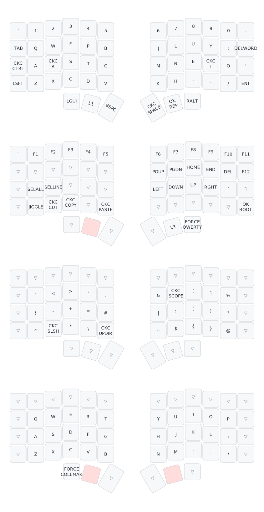

## my silakka54 QMK keymap


## Setup

Clone vial-qmk

```bash
git clone https://github.com/vial-kb/vial-qmk.git ~/git
```
Clone silakka54 repo and move the firmware to vial-qmk

```bash
git clone https://github.com/Squalius-cephalus/silakka54.git ~/tmp/
mv ~/tmp/silakka54/firmware ~/git/vial-qmk/keyboards/silakka54
```

Clone my keymap to silakka54

```bash
git clone --recurse-submodules https://github.com/morphykuffour/silakka54-qmk-keymap.git ~/git/vial-qmk/keyboards/silakka54/keymaps/
```

Compile keymap after setting up qmk
```bash
qmk compile -c -kb silakka54 -km silakka54-qmk-keymap
```

## My keymap

