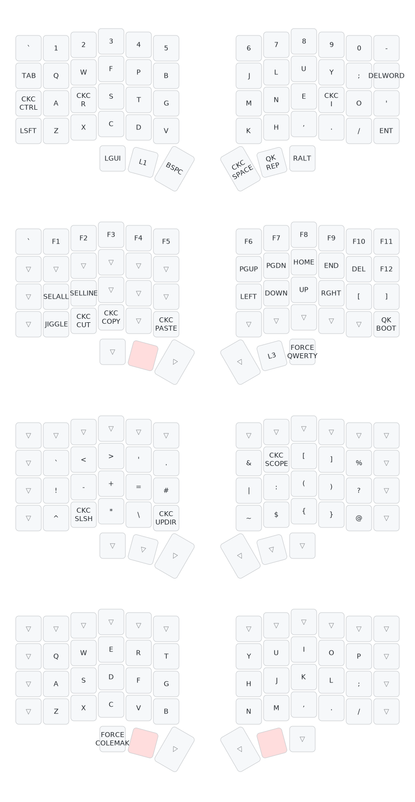

## silakka54 QMK keymap


## Setup

Clone [vial-qmk](https://github.com/vial-kb/vial-qmk):

```bash
git clone https://github.com/vial-kb/vial-qmk.git ~/git/vial-qmk
```

Clone this keymap into the silakka54 keymaps directory (with submodules):

```bash
git clone --recurse-submodules https://github.com/morphykuffour/silakka54-qmk-keymap.git \
  ~/git/vial-qmk/keyboards/silakka54/keymaps/silakka54-qmk-keymap
```

The `silakka54-qmk-keymap/` subdirectory contains symlinks back to the keymap source files
(`keymap.c`, `config.h`, `rules.mk`, `vial.json`, `sm_td`), so QMK finds them at the right path.

## Build

From the keymap repo root (`keyboards/silakka54/keymaps/`):

```bash
make build
```

This calls `nix develop` to pull the toolchain and runs:

```bash
qmk compile -c -kb silakka54 -km silakka54-qmk-keymap
```

Output: `.build/silakka54_silakka54-qmk-keymap.uf2`

### Interactive shell

```bash
nix develop   # sets QMK_HOME and syncs sm_td submodule automatically
qmk compile -c -kb silakka54 -km silakka54-qmk-keymap
```

### Clean

```bash
make clean
```

## Keymap


